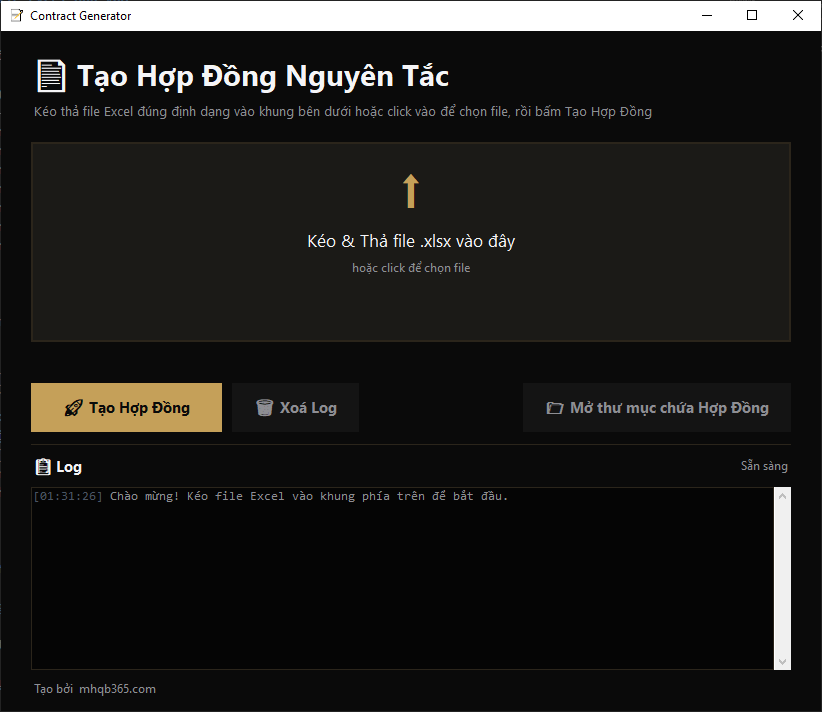

## Cài đặt các thư viện cần thiết

Mở Terminal/PowerShell tại thư mục dự án và chạy lệnh sau để tự động cài đặt toàn bộ các thư viện phụ thuộc cần thiết:

```bash
pip install -r requirements.txt
```

---

## Định Dạng Dữ Liệu Excel & Template

### 1. Định dạng File Excel đầu vào

File dữ liệu Excel mặc định (ví dụ: `Thông tin làm HỢP ĐỒNG NGUYÊN TẮC.xlsx`) cần có cấu trúc các cột tương ứng như sau (chỉ số cột tính từ 0):

|  Cột  | Tên Cột (Chỉ số)  | Dữ Liệu Tương Ứng | Mô tả / Thẻ điền trong Word    |
| :---: | :---------------- | :---------------- | :----------------------------- |
| **B** | Column index `1`  | Tên Công Ty       | `{{ten_cong_ty}}`              |
| **C** | Column index `2`  | Mã Số Thuế        | `{{ma_so_thue}}`               |
| **D** | Column index `3`  | Địa Chỉ           | `{{dia_chi}}`                  |
| **F** | Column index `5`  | Số Tài Khoản      | Kết hợp làm `{{so_tai_khoan}}` |
| **G** | Column index `6`  | Tên Ngân Hàng     | Kết hợp làm `{{so_tai_khoan}}` |
| **J** | Column index `9`  | Người Đại Diện    | `{{nguoi_dai_dien}}`           |
| **K** | Column index `10` | Chức Vụ           | `{{chuc_vu}}`                  |

### 2. Các thẻ giữ chỗ (Placeholders) trong Template Word

Trong file mẫu `templates/HDNT.doc` (hoặc `.docx`), bạn có thể sử dụng các thẻ sau để chương trình tự động điền thông tin:

- `{{thoi_gian_tao}}`: Tự động điền ngày hiện tại dưới dạng `ngày DD tháng MM năm YYYY`.
- `{{ten_cong_ty}}`: Tên đầy đủ của công ty đối tác.
- `{{ma_so_thue}}`: Mã số thuế của doanh nghiệp.
- `{{dia_chi}}`: Địa chỉ đăng ký kinh doanh.
- `{{so_tai_khoan}}`: Số tài khoản ngân hàng ghép dạng: `[Số tài khoản] Mở tại [Tên ngân hàng]`.
- `{{nguoi_dai_dien}}`: Họ và tên người đại diện pháp luật.
- `{{chuc_vu}}`: Chức vụ của người đại diện (ví dụ: Giám đốc, Tổng giám đốc...).

---

## Hướng Dẫn Sử Dụng

### Cách 1: Sử dụng Giao Diện Đồ Họa GUI (Khuyên dùng)

Đây là cách dễ nhất giúp bạn tương tác trực quan với công cụ:

1. Khởi chạy ứng dụng:
   ```bash
   python app.py
   ```
2. Thực hiện kéo thả file Excel vào vùng **"Kéo & Thả file .xlsx vào đây"** hoặc click vào đó để chọn file Excel từ máy tính của bạn.
3. Nhấn nút **Tạo Hợp Đồng** để bắt đầu.
4. Theo dõi tiến trình tạo file DOCX và PDF chi tiết ngay tại bảng **Log** phía dưới.
5. Khi hoàn tất, nhấn nút **Mở thư mục chứa Hợp Đồng** để truy cập ngay danh sách hợp đồng đã xuất bản.

### Cách 2: Sử dụng Dòng lệnh CLI (Không cần giao diện)

Nếu bạn muốn tích hợp công cụ vào một quy trình tự động hóa khác:

1. Đảm bảo file Excel dữ liệu của bạn được đặt tên là `Thông tin làm HỢP ĐỒNG NGUYÊN TẮC.xlsx` tại thư mục gốc của dự án.
2. Chạy lệnh:
   ```bash
   python generate_contracts.py
   ```
3. Chương trình sẽ tự động đọc, xử lý và lưu kết quả vào thư mục `contracts/`.

---

## Lưu Ý Quan Trọng khi Sử Dụng

1. **Tránh xung đột File**: Hãy đóng file Excel dữ liệu và file mẫu Template Word trước khi nhấn nút chạy tool để tránh lỗi quyền truy cập file (`Permission Error`).
2. **Microsoft Word**: Quá trình chuyển đổi `.doc` -> `.docx` và xuất PDF yêu cầu ứng dụng MS Word phải được cài đặt và kích hoạt bình thường trên hệ thống Windows.
3. **Ký tự đặc biệt**: Tên thư mục đầu ra sẽ tự động loại bỏ các ký tự đặc biệt không được Windows cho phép để đảm bảo đường dẫn lưu trữ luôn hợp lệ.
