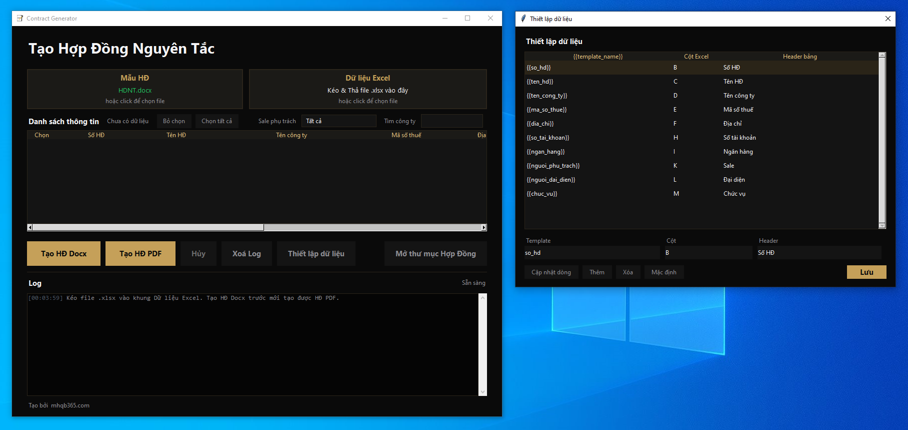

## Cài đặt các thư viện cần thiết

Mở Terminal/PowerShell tại thư mục dự án và chạy lệnh sau để tự động cài đặt toàn bộ các thư viện phụ thuộc cần thiết:

```bash
pip install -r requirements.txt
```

---

## Định Dạng Dữ Liệu Excel & Template

### 1. Định dạng File Excel đầu vào

File dữ liệu Excel có thể được chọn/kéo thả trực tiếp trên giao diện. Dòng đầu tiên được xem là dòng tiêu đề và chương trình bắt đầu đọc dữ liệu từ dòng thứ 2.

Các cột dữ liệu không còn bị cố định trong code. Bạn có thể bấm **Thiết lập dữ liệu** để chỉnh:

- Tên biến trong template Word, ví dụ `{{so_hd}}`.
- Cột Excel tương ứng, ví dụ `B`.
- Tên hiển thị trên header bảng danh sách, ví dụ `Số HĐ`.

Thiết lập được lưu vào file `data_fields.json` và lần mở app sau sẽ tự load lại.

Mapping mặc định hiện tại:

|  Cột  | Tên Cột (Chỉ số)  | Dữ Liệu Tương Ứng | Mô tả / Thẻ điền trong Word    |
| :---: | :---------------- | :---------------- | :----------------------------- |
| **B** | Column index `1`  | Số HĐ             | `{{so_hd}}`                    |
| **C** | Column index `2`  | Tên HĐ            | `{{ten_hd}}`                   |
| **D** | Column index `3`  | Tên Công Ty       | `{{ten_cong_ty}}`              |
| **E** | Column index `4`  | Mã Số Thuế        | `{{ma_so_thue}}`               |
| **F** | Column index `5`  | Địa Chỉ           | `{{dia_chi}}`                  |
| **H** | Column index `7`  | Số Tài Khoản      | Kết hợp làm `{{so_tai_khoan_ngan_hang}}` |
| **I** | Column index `8`  | Tên Ngân Hàng     | Kết hợp làm `{{so_tai_khoan_ngan_hang}}` |
| **K** | Column index `10` | Sale phụ trách    | Dùng để lọc và tạo thư mục     |
| **L** | Column index `11` | Người Đại Diện    | `{{nguoi_dai_dien}}`           |
| **M** | Column index `12` | Chức Vụ           | `{{chuc_vu}}`                  |

### 2. Các thẻ giữ chỗ (Placeholders) trong Template Word

File mẫu mặc định là `templates/HDNT.docx`. Nếu file này tồn tại, app sẽ tự chọn khi mở. Nếu không tồn tại, vùng **Mẫu HĐ** sẽ để trống để bạn click chọn hoặc kéo thả file `.docx`/`.doc`.

Trong template Word, bạn có thể dùng các thẻ theo thiết lập dữ liệu, ví dụ:

- `{{so_hd}}`: Số hợp đồng.
- `{{ten_hd}}`: Tên hợp đồng.
- `{{ten_cong_ty}}`: Tên đầy đủ của công ty đối tác.
- `{{ma_so_thue}}`: Mã số thuế của doanh nghiệp.
- `{{dia_chi}}`: Địa chỉ đăng ký kinh doanh.
- `{{so_tai_khoan_ngan_hang}}`: Số tài khoản ngân hàng ghép dạng: `[Số tài khoản] Mở tại [Tên ngân hàng]`.
- `{{nguoi_dai_dien}}`: Họ và tên người đại diện pháp luật.
- `{{chuc_vu}}`: Chức vụ của người đại diện (ví dụ: Giám đốc, Tổng giám đốc...).

Ngoài các thẻ mặc định, bạn có thể thêm trường mới trong **Thiết lập dữ liệu** và dùng ngay trong template Word theo dạng `{{ten_truong_moi}}`.

---

## Hướng Dẫn Sử Dụng

### Cách 1: Sử dụng Giao Diện Đồ Họa GUI (Khuyên dùng)

Đây là cách dễ nhất giúp bạn tương tác trực quan với công cụ:

1. Khởi chạy ứng dụng:
   ```bash
   python app.py
   ```
2. Chọn file mẫu hợp đồng tại vùng **Mẫu HĐ**. App tự lấy `templates/HDNT.docx` nếu file này có sẵn.
3. Kéo thả hoặc click chọn file Excel tại vùng **Dữ liệu Excel**.
4. Kiểm tra danh sách dữ liệu, lọc theo **Sale phụ trách**, tìm công ty, chọn/bỏ chọn các dòng cần xuất.
5. Nếu cần đổi mapping cột Excel/template/header bảng, bấm **Thiết lập dữ liệu**.
6. Nhấn **Tạo HĐ Docx** hoặc **Tạo HĐ PDF** để bắt đầu.
7. Khi đang chạy, có thể bấm **Hủy** để dừng sau tác vụ hiện tại.
8. Theo dõi tiến trình tại bảng **Log** phía dưới.
9. Khi hoàn tất, nhấn **Mở thư mục Hợp Đồng** để truy cập danh sách hợp đồng đã xuất.

### Cách 2: Sử dụng Dòng lệnh CLI (Không cần giao diện)

Nếu bạn muốn tích hợp công cụ vào một quy trình tự động hóa khác:

1. Đảm bảo file Excel dữ liệu của bạn được đặt tên là `Thông tin làm HỢP ĐỒNG NGUYÊN TẮC.xlsx` tại thư mục gốc của dự án.
2. CLI sẽ dùng template và mapping đang lưu trong `data_fields.json`.
3. Chạy lệnh:
   ```bash
   python generate_contracts.py
   ```
4. Chương trình sẽ tự động đọc, xử lý và lưu kết quả vào thư mục `contracts/`.

### Build app macOS khi không có máy Mac

Project có sẵn GitHub Actions để build file `.app` trên máy macOS của GitHub:

1. Push code lên GitHub.
2. Vào tab **Actions**.
3. Chọn workflow **Build macOS app**.
4. Nhấn **Run workflow**.
5. Khi workflow chạy xong, tải artifact **Contract-Generator-macOS**.
6. Giải nén file `Contract-Generator-macOS.zip`, bên trong có `Contract Generator.app`.

---

## Lưu Ý Quan Trọng khi Sử Dụng

1. **Tránh xung đột File**: Hãy đóng file Excel dữ liệu và file mẫu Template Word trước khi nhấn nút chạy tool để tránh lỗi quyền truy cập file (`Permission Error`).
2. **Template `.doc`**: App có thể nhận `.doc`, nhưng để render hợp đồng cần chuyển sang `.docx`. Trên Windows, quá trình chuyển đổi tự động cần Microsoft Word.
3. **Xuất PDF**: Xuất PDF trên Windows thường cần Microsoft Word. Trên macOS/Linux nên cài LibreOffice để xuất PDF headless.
4. **Ký tự đặc biệt**: Tên thư mục đầu ra sẽ tự động loại bỏ các ký tự đặc biệt không được Windows cho phép để đảm bảo đường dẫn lưu trữ luôn hợp lệ.
